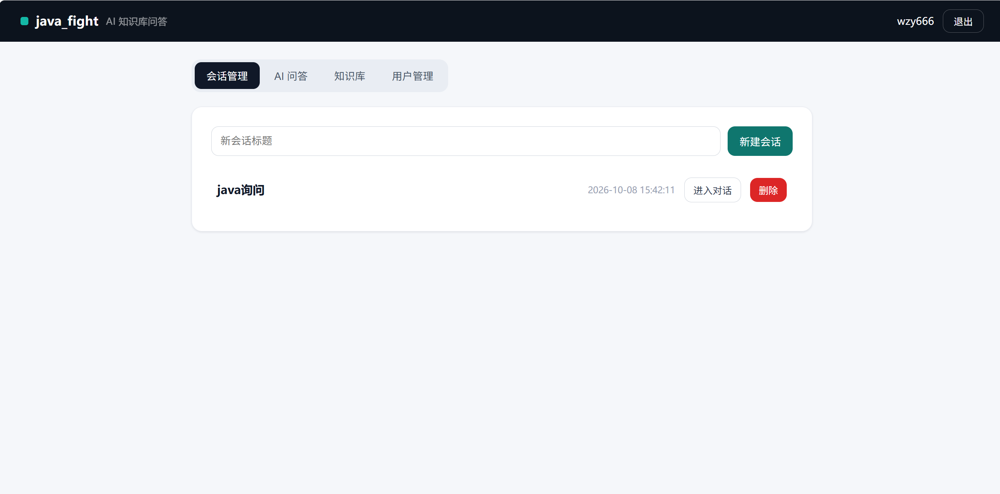
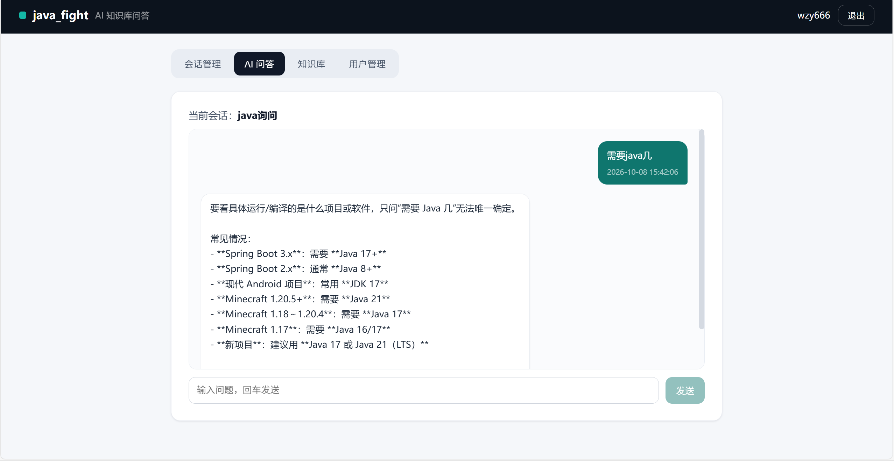
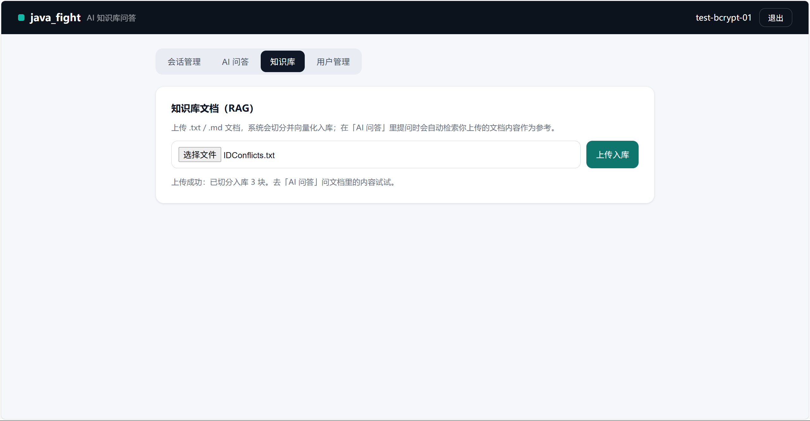
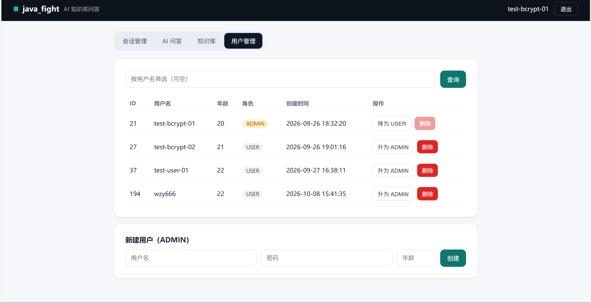

# java_fight

一个以「登录 → 会话 → AI 问答」为主线的 Java 后端项目，重点在后端工程化：JWT 鉴权、Redis 缓存治理、接口限流、事务边界，以及一版最小可用的 RAG 检索问答。

## 技术栈

- Java 21 / Spring Boot 4.1（Spring Framework 7，Jakarta 包名）
- MyBatis + MySQL 8（四张表：用户 / 会话 / 消息 / 文档块）
- Redis（StringRedisTemplate，缓存与互斥锁）
- Spring AI：DeepSeek（对话）+ Ollama 本地 embedding（qwen3-embedding，1024 维）
- Docker / Docker Compose 一键部署

## 功能

- 登录签发 JWT，拦截器统一校验（账号由管理员接口创建，无自助注册）
- 会话管理：会话与消息持久化，历史可回看
- AI 问答：`/chat` 接入 DeepSeek，带超时与重试
- RAG（最小版）：文档上传 → 切块 → 本地 embedding 入库 → 相似度检索，检索结果挂到 `/chat`，按 user_id 隔离
- 演示页面：单文件 HTML + Vue 3（CDN 引入，无构建），随 jar 同源分发，见下

## 后端要点

- 事务边界：外部模型调用移出数据库事务，两段短事务夹一次 AI 调用，避免长耗时请求占满连接池造成整体假死
- 缓存治理：空值哨兵防穿透、`setIfAbsent` 互斥锁防击穿（实测 100 并发 → 1 条 SQL）、`afterCommit` 删缓存避免「删了又被旧事务写回」的脏窗口
- 越权校验：角色看 token、归属查库，删除他人会话返回 403
- 登录限流落在 Service 层（拦截器覆盖不到的原因见代码注释）
- 统一结果封装：`code=1` 成功 / `code=0` 失败

## 演示页面

单文件 HTML + Vue 3（CDN），与后端打在同一个 jar（`src/main/resources/static/`），同源访问，无需 CORS 配置。覆盖登录、会话管理、AI 问答、知识库（RAG）、用户管理。

**AI 问答（多轮上下文，历史持久化）**



**会话管理**



**知识库（RAG）：上传文档切分入库，问答时自动检索参考**



**用户管理：分页查询（动态 SQL）、角色调整、新建用户（ADMIN）**



## 快速启动

需要先设置三个环境变量（只有变量名，不含值）：`DB_PASSWORD`、`JWT_SECRET`、`DEEPSEEK_API_KEY`。详细步骤与排障见 [DEPLOY.md](DEPLOY.md)。

容器方式（推荐，MySQL + Redis + 应用一起起）：

```bash
docker compose up -d --build
```

应用起来后访问 `http://localhost:8080/index.html` 即演示页。AI 问答的 embedding 依赖宿主机 Ollama（`qwen3-embedding` 模型）。

## 项目结构

```
src/main/java/        业务代码（controller / service / mapper / pojo / utils）
src/main/resources/   配置与静态页（static/index.html）
db/                   init.sql（建表 + 初始化）
Dockerfile            单阶段构建
docker-compose.yml    mysql + redis + app 三服务
DEPLOY.md             部署步骤（环境变量说明）
```
